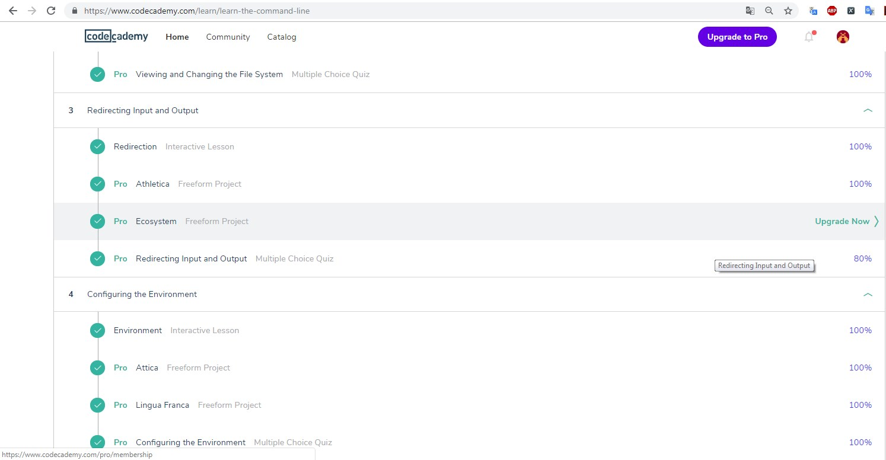
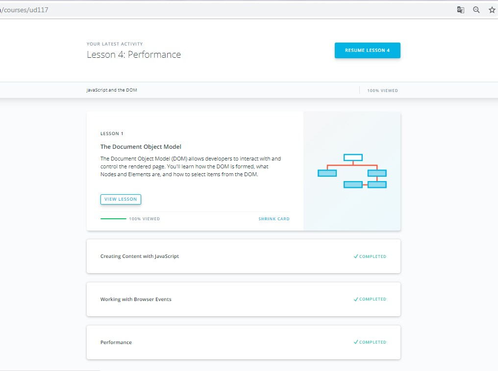

# Front-End Course

## Stage 0. Self-Study

The online stage of _Front-End Course_. Following tasks should be completed at home to participate offline stage. Learn more in [README](https://github.com/kottans/frontend/blob/master/README.md).

---

### General Basics

<!----------------------------- 0. Git Basics --------------------------------->

#### 0. Git Basics

View

- **Git** it's not about abbreviation it's slang 'unpleased person'
- Do one commit per logical change
- Very helpfully for practice Git [sandbox/visualizer](https://learngitbranching.js.org/) from extra material

<!----------------------------- 1. Linux CLI and Networking --------------------------------->

#### 1. Linux CLI, and HTTP

View

<!---------------- 2. VCS (hello gitty), GitHub and Collaboration ----------------->

#### 2. Git Collaboration

View

---

### Front-End Basics

<!------------------------- 3. Intro to HTML &amp; CSS ---------------------------->

#### 3. Intro to HTML &amp; CSS

View

<!------------------------- 4. Responsive Web Design ------------------------------>

#### 4. Responsive Web Design

View

<!--------------------------- 5. JavaScript Basics -------------------------------->

#### 5. JavaScript Basics

View

<!----------------------------------- 6. DOM -------------------------------------->

#### 6. DOM

View

---

### Advanced Topics

#### 7. Building a Tiny JS World

#### 8. Object-Oriented JavaScript

View

#### 9. OOP exercise

#### 10. Offline Web Applications

#### 11. Memory pair game

#### 12. Website Performance Optimization

#### 13. Weather App
